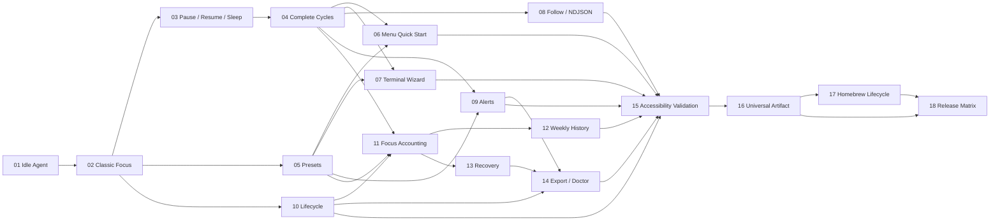

# Pomo Implementation Roadmap

Status: ready-for-agent

This roadmap summarizes dependency topology; it does not duplicate live ticket status. Always compute the current frontier from `issues/`.

## Sources of truth

1. [SPEC.md](SPEC.md) defines ready-for-agent scope, user stories, implementation decisions, test seams, and exclusions.
2. [FEATURES.md](FEATURES.md) preserves detailed grilling/design context.
3. Companion contracts, schemas, and accepted ADRs define normative behavior.
4. Individual issue files define the executable slice, blockers, acceptance criteria, and live status.

## Milestones

### Milestone 1 — Authority, IPC, and direct control

- [01 — Observe an Idle Agent from CLI and menu](issues/01-observe-an-idle-agent-from-cli-and-menu.md)
- [02 — Start and stop a Classic Focus Session](issues/02-start-and-stop-a-classic-focus-session.md)

Outcome: one authoritative Agent, private/versioned IPC, minimal native menu countdown, and direct non-interactive Start/Status/Stop.

### Milestone 2 — Complete interactive Session experience

- [03 — Pause, resume, and survive sleep correctly](issues/03-pause-resume-and-survive-sleep-correctly.md)
- [04 — Run complete finite and open-ended Pomodoro cycles](issues/04-run-complete-finite-and-open-ended-pomodoro-cycles.md)
- [05 — Manage named Presets and the default](issues/05-manage-named-presets-and-the-default.md)
- [06 — Quick-start and customize Sessions from the menu](issues/06-quick-start-and-customize-sessions-from-the-menu.md)
- [07 — Configure Sessions through the terminal wizard](issues/07-configure-sessions-through-the-terminal-wizard.md)
- [08 — Observe Sessions through Follow and NDJSON](issues/08-observe-sessions-through-follow-and-ndjson.md)
- [09 — Onboard users and deliver completion alerts](issues/09-onboard-users-and-deliver-completion-alerts.md)
- [10 — Handle launch, quit, crash, and login lifecycle](issues/10-handle-launch-quit-crash-and-login-lifecycle.md)

Outcome: complete Phase/Round behavior, Presets, native and terminal interaction, alerts, and lifecycle integration.

### Milestone 3 — Accounting, history, and Recovery

- [11 — Persist Focus accounting and show today’s summary](issues/11-persist-focus-accounting-and-show-todays-summary.md)
- [12 — Review weekly history, streaks, and clear summaries](issues/12-review-weekly-history-streaks-and-clear-summaries.md)
- [13 — Recover safely from accounting and migration failures](issues/13-recover-safely-from-accounting-and-migration-failures.md)
- [14 — Export Recovery evidence and diagnose Pomo](issues/14-export-recovery-evidence-and-diagnose-pomo.md)

Outcome: exact Focus accounting, user summaries, migrations/backups, capability-driven Recovery, export, and diagnostics.

### Milestone 4 — Accessibility and distribution

- [15 — Validate complete accessible native and terminal workflows](issues/15-validate-complete-accessible-native-and-terminal-workflows.md)
- [16 — Build and verify the universal direct-release artifact](issues/16-build-and-verify-the-universal-direct-release-artifact.md)
- [17 — Install, upgrade, uninstall, and zap through Homebrew](issues/17-install-upgrade-uninstall-and-zap-through-homebrew.md)
- [18 — Automate approved releases and run the final quality matrix](issues/18-automate-approved-releases-and-run-the-final-quality-matrix.md)

Outcome: complete accessibility evidence, universal artifacts, project-tap lifecycle, protected publication, and the final platform/performance matrix.

## Blocker graph

## Frontier rules

- Initial frontier: Ticket 01 only.
- After Ticket 02 resolves, Tickets 03, 05, and 10 can proceed independently.
- A ticket is available only when every number in its `Blocked by` field is `resolved`.
- Claim before editing by changing `ready-for-agent` to `claimed`.
- Only one worker edits a shared code area unless isolated worktrees prevent overlap.
- Ticket 15 is the convergence gate before packaging; Ticket 18 is the final publication gate.

## Completion evidence

Each ticket appends exact validation commands, environment, result, and evidence before changing to `resolved`. A failing external dependency or unresolved requirement changes the ticket to `blocked` and records details in the feature blocker log.
